```mermaid
flowchart TB
    subgraph current["Learning.csproj"]
        MAIN["<b>⚙️&nbsp;Learning.csproj</b><br/><small>net48</small>"]
        click MAIN "#learninglearninglearningcsproj"
    end

```

# Projects and dependencies analysis

This document provides a comprehensive overview of the projects and their dependencies in the context of upgrading to .NETCoreApp,Version=v8.0.

## Table of Contents

- [Executive Summary](#executive-Summary)
  - [Highlevel Metrics](#highlevel-metrics)
  - [Projects Compatibility](#projects-compatibility)
  - [Package Compatibility](#package-compatibility)
  - [API Compatibility](#api-compatibility)
- [Aggregate NuGet packages details](#aggregate-nuget-packages-details)
- [Top API Migration Challenges](#top-api-migration-challenges)
  - [Technologies and Features](#technologies-and-features)
  - [Most Frequent API Issues](#most-frequent-api-issues)
- [Projects Relationship Graph](#projects-relationship-graph)
- [Project Details](#project-details)

  - [Learning\Learning\Learning.csproj](#learninglearninglearningcsproj)

## Executive Summary

### Highlevel Metrics

| Metric | Count | Status |
| :--- | :---: | :--- |
| Total Projects | 1 | All require upgrade |
| Total NuGet Packages | 0 | All compatible |
| Total Code Files | 22 |  |
| Total Code Files with Incidents | 22 |  |
| Total Lines of Code | 1613 |  |
| Total Number of Issues | 1703 |  |
| Estimated LOC to modify | 1701+ | at least 105.5% of codebase |

### Projects Compatibility

| Project | Target Framework | Difficulty | Package Issues | API Issues | Est. LOC Impact | Description |
| :--- | :---: | :---: | :---: | :---: | :---: | :--- |
| [Learning\Learning\Learning.csproj](#learninglearninglearningcsproj) | net48 | 🟡 Medium | 0 | 1701 | 1701+ | ClassicWinForms, Sdk Style = False |

### Package Compatibility

| Status | Count | Percentage |
| :--- | :---: | :---: |
| ✅ Compatible | 0 | 0.0% |
| ⚠️ Incompatible | 0 | 0.0% |
| 🔄 Upgrade Recommended | 0 | 0.0% |
| ***Total NuGet Packages*** | ***0*** | ***100%*** |

### API Compatibility

| Category | Count | Impact |
| :--- | :---: | :--- |
| 🔴 Binary Incompatible | 1413 | High - Require code changes |
| 🟡 Source Incompatible | 288 | Medium - Needs re-compilation and potential conflicting API error fixing |
| 🔵 Behavioral change | 0 | Low - Behavioral changes that may require testing at runtime |
| ✅ Compatible | 1011 |  |
| ***Total APIs Analyzed*** | ***2712*** |  |

## Aggregate NuGet packages details

| Package | Current Version | Suggested Version | Projects | Description |
| :--- | :---: | :---: | :--- | :--- |

## Top API Migration Challenges

### Technologies and Features

| Technology | Issues | Percentage | Migration Path |
| :--- | :---: | :---: | :--- |
| Windows Forms | 1413 | 83.1% | Windows Forms APIs for building Windows desktop applications with traditional Forms-based UI that are available in .NET on Windows. Enable Windows Desktop support: Option 1 (Recommended): Target net9.0-windows; Option 2: Add <UseWindowsDesktop>true</UseWindowsDesktop>; Option 3 (Legacy): Use Microsoft.NET.Sdk.WindowsDesktop SDK. |
| GDI+ / System.Drawing | 286 | 16.8% | System.Drawing APIs for 2D graphics, imaging, and printing that are available via NuGet package System.Drawing.Common. Note: Not recommended for server scenarios due to Windows dependencies; consider cross-platform alternatives like SkiaSharp or ImageSharp for new code. |
| Legacy Configuration System | 2 | 0.1% | Legacy XML-based configuration system (app.config/web.config) that has been replaced by a more flexible configuration model in .NET Core. The old system was rigid and XML-based. Migrate to Microsoft.Extensions.Configuration with JSON/environment variables; use System.Configuration.ConfigurationManager NuGet package as interim bridge if needed. |

### Most Frequent API Issues

| API | Count | Percentage | Category |
| :--- | :---: | :---: | :--- |
| T:System.Windows.Forms.Button | 183 | 10.8% | Binary Incompatible |
| T:System.Windows.Forms.Label | 129 | 7.6% | Binary Incompatible |
| T:System.Drawing.Font | 60 | 3.5% | Source Incompatible |
| T:System.Drawing.GraphicsUnit | 58 | 3.4% | Source Incompatible |
| T:System.Drawing.FontStyle | 58 | 3.4% | Source Incompatible |
| P:System.Windows.Forms.Control.Name | 47 | 2.8% | Binary Incompatible |
| T:System.Windows.Forms.Control.ControlCollection | 38 | 2.2% | Binary Incompatible |
| P:System.Windows.Forms.Control.Controls | 38 | 2.2% | Binary Incompatible |
| M:System.Windows.Forms.Control.ControlCollection.Add(System.Windows.Forms.Control) | 38 | 2.2% | Binary Incompatible |
| P:System.Windows.Forms.Control.Location | 38 | 2.2% | Binary Incompatible |
| T:System.Windows.Forms.ComboBox | 38 | 2.2% | Binary Incompatible |
| P:System.Windows.Forms.Control.TabIndex | 37 | 2.2% | Binary Incompatible |
| P:System.Windows.Forms.Control.Size | 37 | 2.2% | Binary Incompatible |
| F:System.Drawing.GraphicsUnit.Point | 29 | 1.7% | Source Incompatible |
| F:System.Drawing.FontStyle.Regular | 29 | 1.7% | Source Incompatible |
| M:System.Drawing.Font.#ctor(System.String,System.Single,System.Drawing.FontStyle,System.Drawing.GraphicsUnit,System.Byte) | 29 | 1.7% | Source Incompatible |
| P:System.Windows.Forms.Control.Font | 29 | 1.7% | Binary Incompatible |
| T:System.Windows.Forms.AutoScaleMode | 27 | 1.6% | Binary Incompatible |
| P:System.Windows.Forms.Label.Text | 20 | 1.2% | Binary Incompatible |
| T:System.Windows.Forms.CheckedListBox | 20 | 1.2% | Binary Incompatible |
| T:System.Windows.Forms.TreeView | 19 | 1.1% | Binary Incompatible |
| M:System.Windows.Forms.Form.#ctor | 18 | 1.1% | Binary Incompatible |
| T:System.Windows.Forms.ProgressBar | 18 | 1.1% | Binary Incompatible |
| T:System.Windows.Forms.ColumnHeader | 18 | 1.1% | Binary Incompatible |
| T:System.Windows.Forms.PictureBox | 17 | 1.0% | Binary Incompatible |
| P:System.Windows.Forms.ButtonBase.Text | 16 | 0.9% | Binary Incompatible |
| T:System.Windows.Forms.ListView | 16 | 0.9% | Binary Incompatible |
| P:System.Windows.Forms.ButtonBase.UseVisualStyleBackColor | 15 | 0.9% | Binary Incompatible |
| M:System.Windows.Forms.Button.#ctor | 15 | 0.9% | Binary Incompatible |
| T:System.Windows.Forms.LinkLabel | 15 | 0.9% | Binary Incompatible |
| T:System.Windows.Forms.TreeNode | 14 | 0.8% | Binary Incompatible |
| T:System.Drawing.Bitmap | 13 | 0.8% | Source Incompatible |
| T:System.Windows.Forms.DateTimePicker | 13 | 0.8% | Binary Incompatible |
| E:System.Windows.Forms.Control.Click | 13 | 0.8% | Binary Incompatible |
| T:System.Windows.Forms.NumericUpDown | 13 | 0.8% | Binary Incompatible |
| P:System.Windows.Forms.Label.AutoSize | 11 | 0.6% | Binary Incompatible |
| T:System.Windows.Forms.ImageList | 10 | 0.6% | Binary Incompatible |
| M:System.Windows.Forms.Label.#ctor | 10 | 0.6% | Binary Incompatible |
| T:System.Windows.Forms.MonthCalendar | 10 | 0.6% | Binary Incompatible |
| T:System.Windows.Forms.NotifyIcon | 10 | 0.6% | Binary Incompatible |
| M:System.Windows.Forms.Control.ResumeLayout(System.Boolean) | 9 | 0.5% | Binary Incompatible |
| P:System.Windows.Forms.Form.Text | 9 | 0.5% | Binary Incompatible |
| P:System.Windows.Forms.Form.ClientSize | 9 | 0.5% | Binary Incompatible |
| F:System.Windows.Forms.AutoScaleMode.Font | 9 | 0.5% | Binary Incompatible |
| P:System.Windows.Forms.ContainerControl.AutoScaleMode | 9 | 0.5% | Binary Incompatible |
| P:System.Windows.Forms.ContainerControl.AutoScaleDimensions | 9 | 0.5% | Binary Incompatible |
| M:System.Windows.Forms.Control.SuspendLayout | 9 | 0.5% | Binary Incompatible |
| M:System.Windows.Forms.Form.Dispose(System.Boolean) | 9 | 0.5% | Binary Incompatible |
| P:System.Windows.Forms.TreeViewEventArgs.Node | 9 | 0.5% | Binary Incompatible |
| T:System.Windows.Forms.Form | 9 | 0.5% | Binary Incompatible |

## Projects Relationship Graph

Legend:
📦 SDK-style project
⚙️ Classic project

## Project Details

### Learning\Learning\Learning.csproj

#### Project Info

- **Current Target Framework:** net48
- **Proposed Target Framework:** net8.0-windows
- **SDK-style**: False
- **Project Kind:** ClassicWinForms
- **Dependencies**: 0
- **Dependants**: 0
- **Number of Files**: 32
- **Number of Files with Incidents**: 22
- **Lines of Code**: 1613
- **Estimated LOC to modify**: 1701+ (at least 105.5% of the project)

#### Dependency Graph

Legend:
📦 SDK-style project
⚙️ Classic project

### API Compatibility

| Category | Count | Impact |
| :--- | :---: | :--- |
| 🔴 Binary Incompatible | 1413 | High - Require code changes |
| 🟡 Source Incompatible | 288 | Medium - Needs re-compilation and potential conflicting API error fixing |
| 🔵 Behavioral change | 0 | Low - Behavioral changes that may require testing at runtime |
| ✅ Compatible | 1011 |  |
| ***Total APIs Analyzed*** | ***2712*** |  |

#### Project Technologies and Features

| Technology | Issues | Percentage | Migration Path |
| :--- | :---: | :---: | :--- |
| Legacy Configuration System | 2 | 0.1% | Legacy XML-based configuration system (app.config/web.config) that has been replaced by a more flexible configuration model in .NET Core. The old system was rigid and XML-based. Migrate to Microsoft.Extensions.Configuration with JSON/environment variables; use System.Configuration.ConfigurationManager NuGet package as interim bridge if needed. |
| GDI+ / System.Drawing | 286 | 16.8% | System.Drawing APIs for 2D graphics, imaging, and printing that are available via NuGet package System.Drawing.Common. Note: Not recommended for server scenarios due to Windows dependencies; consider cross-platform alternatives like SkiaSharp or ImageSharp for new code. |
| Windows Forms | 1413 | 83.1% | Windows Forms APIs for building Windows desktop applications with traditional Forms-based UI that are available in .NET on Windows. Enable Windows Desktop support: Option 1 (Recommended): Target net9.0-windows; Option 2: Add <UseWindowsDesktop>true</UseWindowsDesktop>; Option 3 (Legacy): Use Microsoft.NET.Sdk.WindowsDesktop SDK. |

